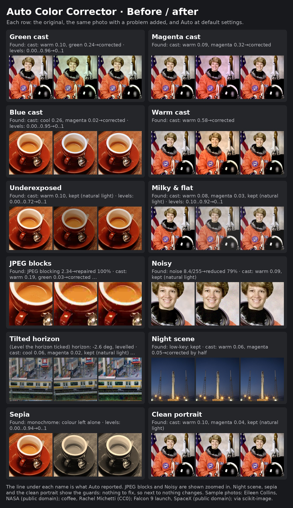

# Stable Diffusion Forge: Auto Color Corrector

Fixes what is off in every generated image, and nothing else: JPEG blocking,
noise, colour casts, milky blacks, a frame that is too dark or too bright, flat
or harsh contrast, dull colour, and (when ticked) a tilted horizon. Each fix measures the image first and is skipped when there is
nothing to fix, so a well-made image comes through untouched. Works on Forge,
reForge and Forge Classic (Neo). No models, no downloads: it reads the
picture's own histogram and colours.



## Where it fits

Three extensions split the work the way a photo is made, and run in this
order:

| 1. [Auto Color Corrector](https://github.com/sca-285/sd-forge-auto-color-corrector) | 2. [Optical Realism](https://github.com/sca-285/sd-forge-optical-realism) | 3. [Digital Mastering](https://github.com/sca-285/sd-webui-digital-mastering) |
|---|---|---|
| **Correction**, automatic: measures the image and fixes only what is off (colour cast, black and white points, exposure, flat or harsh contrast, dull colour, JPEG blocks, noise, a tilted horizon), or matches a reference picture | **The camera**: lens geometry, vignette, purple fringing, depth of field and bokeh, tilt-shift, blur, bloom, flare, anamorphic streak, star filter, god rays, halation, light wrap, flash, haze, grain, dust, scratches, date stamp, highlight roll-off, retro video | **The grade**, by hand or by preset: exposure, contrast, white balance, saturation, vibrance, split toning, CDL, LUT, selective colour, clarity, sharpen, overlays, HSL, colour wheels, tone curves, black & white, dehaze, skin smoothing, local light, subtitles, anti-banding |

No two of them do the same job. Auto Color Corrector and Digital Mastering
both touch exposure and white balance, but for opposite ends: the corrector
brings a faulty picture back to neutral by itself and leaves a sound one
alone; Digital Mastering moves a picture away from neutral, on purpose, by
the amount you set. Correct first, then shoot, then grade.

A grade laid on a picture with a green cast or crushed blacks carries the
fault along; correcting first gives the other two a clean start. Nothing
here is a look: for looks, use the presets of the other two.

## What Auto does

| Step | Detects | Fixes |
|---|---|---|
| JPEG blocking | How much stronger the steps across the 8x8 JPEG grid are than inside the blocks (about 1.0 when clean, 1.3 at quality 50, 1.7+ at quality 20), on the full-size picture | De-blocking along the grid and de-ringing round edges, as strong as the blocking measured (moved here from Digital Mastering) |
| Noise | The noise level (Immerkaer's method) over the flatter half of the picture, so texture is not taken for noise | Colour noise smoothed hard, luminance noise gently and only away from edges |
| Colour cast | The colour of the bright near-neutral pixels (a white shirt, a cup, clouds), on both axes: warm/cool and green/magenta | White balance in linear light, by the size of the cast. Warm and cool light within an everyday range is kept as natural light; green and magenta casts get almost no allowance |
| Black & white points | Milky blacks, dull whites (0.5 % and 99.5 % percentiles) | Levels, capped so nothing clips |
| Exposure | A median brightness outside the normal band, or clipped whites | Exposure in linear light, with a shoulder so black stays black and white stays white; brought to the edge of the band, not to one "correct" grey |
| Contrast | A flat or harsh histogram (its middle half) | A gentle S-curve around the picture's own middle grey |
| Colour strength | Dull or overcooked colour | Vibrance: weak colours move most, skin and strong colours least |
| Reference (optional) | Your reference picture | Its colour and spread (mean and deviation in Lab), at Reference strength |
| Horizon (off by default) | The tilt of the long straight edges near horizontal and vertical (horizons, buildings, door frames), from the structure tensor, with a confidence | Turns the picture level and scales it just enough to hide the corners; only when confident (streets, buildings), never for pictures without straight lines. Done after Overall strength, so the turned and the original picture never mix |

**Guards** keep deliberate pictures as they are:

- **Low-key** (dark with real highlights: night, neon, a lit face): no lift,
  no levels, no contrast or colour boost; a cast is corrected by half.
- **High-key** (bright with real darks: snow, white backdrops): not pulled down.
- **Black & white or toned** (sepia, cyanotype): no colour fixes.
- **No neutrals to measure** (golden hour, neon): the colour is left alone.
- **Almost one tone** (a plain backdrop): the tone is left alone.
- **Keep mood** keeps a share of any cast it finds.

Skin tone is not corrected on its own: without a person detector, orange
clothes, wood and coffee measure as skin. A cast on skin is fixed by the white
balance; Digital Mastering's HSL (orange, red) adjusts skin by hand.

Each step has an on/off box and a strength slider; **Overall strength**
(default 0.8) blends the whole correction with the original.

## What it found

The console prints a line per image, and PNG info carries it:

    Auto Color Corrector found: cast: warm 0.10, green 0.24 -> corrected · levels: 0.00..0.96 -> 0..1

## X/Y/Z plot

Axes for the X/Y/Z plot script, under `[ACC]`: Overall strength, Keep mood,
and on/off for each fix (colour cast, black & white points, exposure,
contrast, colour strength, JPEG blocking, noise, horizon, low-key / high-key
guard). A cell that sets any of
them switches the corrector on for that cell.

## PNG info

`Auto Color Corrector` holds the settings that differ from the defaults
(`on` for a stock run); Send to / Paste restores them. The reference picture
is not stored.

## Files

```
scripts/auto_color_corrector.py   UI + host hook
lib_acc/auto.py                   measuring, guards and the plan of corrections
lib_acc/ops.py                    the colour maths, pure torch
lib_acc/repair.py                 JPEG blocking, noise and horizon: measuring and fixing
lib_acc/controls.py               every control, declared once (UI, PNG info)
lib_acc/xyz.py                    X/Y/Z plot axes
lib_acc/reference.py              the folded before / after picture
reference.jpg                     the before / after picture
style.css                         reference box
```

## Credits

- Started as a conversion of
  [ComfyUI-EasyColorCorrector](https://github.com/regiellis/ComfyUI-EasyColorCorrector)
  by Regi E. (MIT); the Auto correction has since been rewritten.
- Sample photos in `reference.jpg`, from scikit-image's sample data:
  Eileen Collins by NASA (public domain), coffee cup by Rachel Michetti (CC0),
  Falcon 9 launch by SpaceX (public domain).

Thanks also to **Claude**, for help building this
extension.

## License

MIT, see `LICENSE` and `NOTICE.md`.
